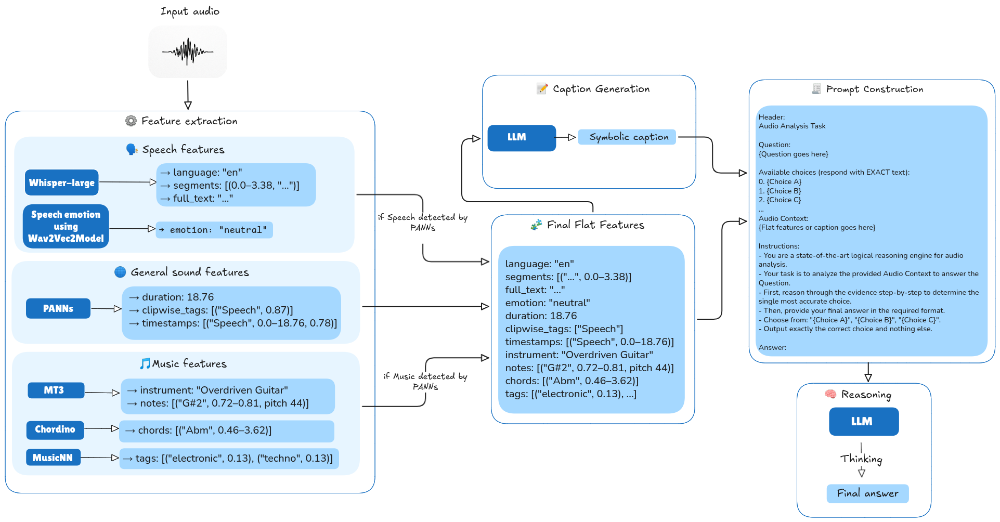

<p align="center">
  
</p>

<h1 align="center">SAR-LM: Symbolic Audio Reasoning with Large Language Models</h1>
<p align="center">
  <a href="https://termehtaheri.github.io/SAR-LM/">
    
  </a>
  <a href="https://arxiv.org/abs/TBD">
    
  </a>
  <a href="https://huggingface.co/datasets/TermehTaheri/SAR-LM">
    
  </a>
</p>

---

## ✨ Overview

Large language models (LLMs) have made major progress in **text** and **vision**, yet their ability to **reason about sound** remains underdeveloped.  
Most systems rely on dense embeddings (e.g., CLAP, BEATs), which are powerful but opaque — they offer little interpretability and struggle with structured reasoning.

🎧 **SAR-LM** introduces a **symbolic audio reasoning pipeline** that converts audio into **human-readable, interpretable text features** — including transcripts, sound events, emotions, chords, and tags — before reasoning with large language models such as **Gemini-2.5-Pro** and **Qwen-3**.

- Modular design with interpretable symbolic inputs  
- Compatible with reasoning and captioning benchmarks (MMAU, MMAR, OmniBench)  
- Enables detailed error tracing across speech, sound, and music domains  
- Demonstrates competitive results with strong interpretability gains  

<p align="center">
  
  <br>
  <em>Figure 1. SAR-LM pipeline — audio is converted into symbolic features (speech, sound, and music) before LLM reasoning.</em>
</p>

---

## 🧩 Pipeline Overview

SAR-LM follows four key stages:

1. **Symbolic Feature Extraction**  
   - Extract speech, sound, and music features using pretrained and signal-processing models (Whisper, PANNs, MT3, Chordino, Musicnn, DAWN).  
   - Each feature is aligned to the audio timeline and represented as text.

2. **Prompt Construction**  
   - Combine symbolic features and benchmark questions into structured natural language prompts.  
   - Supports both *flat* and *caption-based* prompting styles.

3. **Caption Generation**  
   - Summarize symbolic features into natural language paragraphs for concise reasoning input.

4. **Reasoning with LLMs**  
   - Use open-source or API-based LLMs (Gemini-2.5-Pro, Qwen-3-Instruct, Qwen-Omni) to answer benchmark questions.  
   - Designed for interpretability and transparency in failure analysis.

---

## 🧮 Results Summary

| Reasoner         | MMAU (%) | MMAR (%) | OmniBench (%) |
|------------------|-----------|-----------|----------------|
| Qwen2.5-Omni     | 64.6 | 48.5 | 30.7 |
| Qwen3-Instruct   | 67.2 | 54.9 | 35.8 |
| **Gemini-2.5-Pro** | **73.5** | **69.3** | **38.7** |

<p align="center">
  <em>Table 1. Overall reasoning accuracy (%) using symbolic features across benchmarks.</em>
</p>

---

### Task-Wise Accuracy on MMAU (Qwen-3-Instruct)

| Input Type | Sound | Music | Speech | Overall |
|-------------|--------|--------|---------|----------|
| Symbolic Features | 69.37 | 56.59 | **73.87** | 66.6 |
| Symbolic Features (agent) | **72.67** | 57.78 | **73.87** | **68.1** |
| Symbolic Captions | 69.67 | 58.38 | 71.77 | 66.6 |
| End-to-End Captions | 68.17 | **62.28** | 69.97 | 66.8 |

<p align="center">
  <em>Table 2. Task-wise reasoning accuracy (%) on the MMAU benchmark.</em>
</p>

---

## ⚙️ Installation

Clone the repository:

```bash
git clone https://github.com/termehtaheri/SAR-LM.git
cd SAR-LM
```

### Option 1: Using Virtual Environments (Recommended)

```bash
python -m venv venv
source venv/bin/activate
pip install -r requirements/reasoning.txt
```

### Option 2: Using Docker

Each module (extractors, captioning, reasoning) has its own Dockerfile.  
You can build all at once:

```bash
docker-compose build
```

Or build a single module:

```bash
docker-compose build whisper
```

---

## 🚀 Quick Start

### 🧠 Run Reasoning Pipeline

```bash
PYTHONPATH=src python -m sar_lm.pipelines.reasoning_pipeline \
  --reasoner qwen3 \
  --features outputs/features_merged/features_merged.json \
  --qa examples/sample_qa.json \
  --output outputs/reasoning/qwen3_results.json
```

### 📝 Generate Symbolic Captions

```bash
PYTHONPATH=src python -m sar_lm.pipelines.captioning_pipeline \
  --mode symbolic \
  --audio_dir examples \
  --features outputs/features_merged/features_merged.json \
  --output outputs/captions/symbolic_captions.json
```

### 🧩 Merge Features

```bash
PYTHONPATH=src python -m sar_lm.utils.merge_features \
  --input_dir outputs/features_* \
  --output outputs/features_merged/features_merged.json
```

---

## 🧠 Benchmarks Used

SAR-LM evaluates reasoning on three major benchmarks:

| Benchmark | Domain | Description |
|------------|---------|-------------|
| **MMAU** | Speech, Sound, Music | Multi-task audio understanding and reasoning benchmark. |
| **MMAR** | Multimodal | Chain-of-thought annotated audio QA dataset. |
| **OmniBench** | Tri-Modal | Audio–visual–text reasoning benchmark. |

---

## 🔬 Interpretability and Error Analysis

SAR-LM emphasizes **explainability** over raw accuracy.  
Each symbolic layer (speech, emotion, chords, sound events) is human-readable — enabling fine-grained failure tracing.  
Example failure: missed short-duration sound events (e.g., *light switch clicks*) leading to incorrect temporal ordering, easily identified in the symbolic trace.

---

## 📦 Repository Structure

```
SAR-LM/
├── src/sar_lm/
│   ├── extractors/        # PANNs, Whisper, MT3, Musicnn, etc.
│   ├── captions/          # Symbolic, Mixed, and End-to-End captioners
│   ├── reasoners/         # Gemini, Qwen3, and Qwen-Omni backends
│   ├── pipelines/         # High-level pipelines (extract, caption, reason)
│   └── utils/             # Merging and formatting utilities
├── examples/              # Sample audios and QA
├── outputs/               # Generated features and results
├── docker/                # Dockerfiles for each module
├── requirements/          # Separate env files for extractors and reasoning
└── CITATION.cff
```

---

## 🪶 Citation

If you find **SAR-LM** useful for your research, please cite:

```bibtex
@article{taheri2025sarlm,
  title={SAR-LM: Symbolic Audio Reasoning with Large Language Models},
  author={Taheri, Termeh and Ma, Yinghao and Benetos, Emmanouil},
  journal={Proc. IEEE ICASSP},
  year={2026},
  url={https://arxiv.org/abs/TBD}
}
```

---

<p align="center">
  
  <br>
  <em>© 2025 Termeh Taheri, Yinghao Ma, Emmanouil Benetos</em>
</p>
